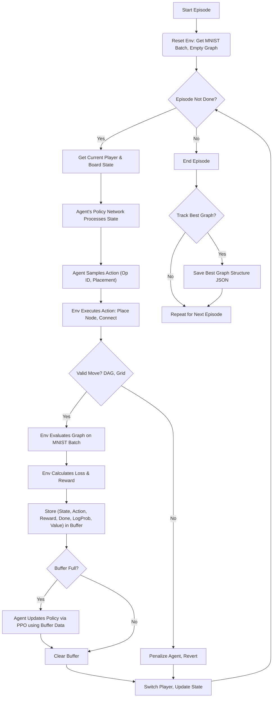

# Reinforce Neural Architecture (For LLMs Architecture optimization)

This project focuses on enabling AI to autonomously construct optimal neural architectures from scratch. By leveraging only the fundamental building blocks of mathematics, the AI is guided to discover and create entirely new neural network structures.

# Main Objective
The goal is to allow the AI to explore beyond human-designed architectures—potentially uncovering novel neural network designs that may have been previously overlooked by researchers.

# Fundamental Math of everything:
| Field                      | Operation                | Notation                | Function Form                           | Inverse Operation             | Inverse Notation        | Function Form (Inverse)                      |
|----------------------------|--------------------------|-------------------------|-----------------------------------------|-------------------------------|-------------------------|----------------------------------------------|
| **Arithmetic**             | Addition                 | `x + y`                 | `f(x,y)=x+y`                            | Subtraction                   | `x - y`                 | `g(x,y)=x-y`                                 |
| **Arithmetic**             | Subtraction              | `x - y`                 | `f(x,y)=x-y`                            | Addition                       | `x + y`                 | `g(x,y)=x+y`                                 |
| **Arithmetic**             | Multiplication           | `x * y`                 | `f(x,y)=x·y`                            | Division                       | `x / y`                 | `g(x,y)=x/y`                                 |
| **Arithmetic**             | Division                 | `x / y`                 | `f(x,y)=x/y`                            | Multiplication                 | `x * y`                 | `g(x,y)=x·y`                                 |
| **Algebra**                | Exponentiation           | `x^y`                   | `f(x,y)=x^y`                            | Logarithm                      | `log_b x`              | `g(x)=log_b(x)`                              |
| **Algebra**                | Root Extraction          | `y√x`                   | `f(x,y)=x^(1/y)`                        | Exponentiation                 | `x^y`                   | `g(x,y)=x^y`                                 |
| **Calculus**               | Derivative               | `f'(x)` / `d/dx f(x)`   | `f'(x)=limₕ→0[f(x+h)-f(x)]/h`           | Integral                       | `∫ f(x) dx`             | `G(x)=∫f(x)dx`                               |
| **Calculus**               | Integral                 | `∫ f(x) dx`             | `G'(x)=f(x)` and `∫ₐᵇf=G(b)-G(a)`         | Derivative                     | `d/dx f(x)`            | `g(x)=f'(x)`                                 |
| **Transforms**             | Fourier Transform        | `ℱ{f}(ω)`              | `∫₋∞^∞f(t)e^{-iωt}dt`                   | Inverse Fourier Transform      | `ℱ⁻¹{F}(t)`           | `1/2π∫₋∞^∞F(ω)e^{iωt}dω`                    |
| **Transforms**             | Laplace Transform        | `ℒ{f}(s)`              | `∫₀^∞e^{-st}f(t)dt`                     | Inverse Laplace Transform      | `ℒ⁻¹{F}(t)`           | complex Bromwich integral                   |
| **Transforms**             | Z‑Transform              | `Z{f}[z]`              | `∑₀^∞f[n]z^{-n}`                        | Inverse Z‑Transform            | `Z⁻¹{F}[n]`           | complex contour sum                         |
| **Functional Analysis**    | Convolution              | `f * g`                 | `∫f(τ)g(t−τ)dτ`                         | Deconvolution                  | —                       | inverse integral deconvolution              |
| **Set Theory**             | Union                    | `A ∪ B`                 | `{x: x∈A or x∈B}`                       | N/A                            | —                       | —                                            |
| **Set Theory**             | Intersection             | `A ∩ B`                 | `{x: x∈A and x∈B}`                      | N/A                            | —                       | —                                            |
| **Set Theory**             | Complement               | `Aᶜ`                     | `{x: x∉A}`                               | Complement                     | `Aᶜ`                     | `{x: x∉(Aᶜ)}`                                |
| **Set Theory**             | Cartesian Product        | `A × B`                 | `{(a,b):a∈A, b∈B}`                     | Projection                     | `π₁, π₂`               | `(π₁(x,y)=x, π₂(x,y)=y)`                     |
| **Logic**                  | Conjunction (AND)        | `A ∧ B`                 | true if both true                       | N/A                            | —                       | —                                            |
| **Logic**                  | Disjunction (OR)         | `A ∨ B`                 | true if ≥1 true                         | N/A                            | —                       | —                                            |
| **Logic**                  | Negation (NOT)           | `¬A`                     | true if A is false                      | Negation                       | `¬A`                     | true if A is false                           |
| **Logic**                  | Quantifiers              | `∀x, ∃x`               | checks predicate over domain            | N/A                            | —                       | —                                            |
| **Functions**              | Composition              | `(f ∘ g)(x)`            | `f(g(x))`                               | Decomposition (when invertible) | `(g⁻¹ ∘ f⁻¹)(x)`       | undoes composition if inverses exist         |
| **Linear Algebra**         | Vector Addition          | `u + v`                 | component‐wise sum                      | Vector Subtraction             | `u - v`                 | `g(u,v)=u-v`                                 |
| **Linear Algebra**         | Scalar Multiplication    | `a·v`                   | scales vector by a scalar               | Scalar Division                | `v/a`                   | `g(a,v)=v/a`                                 |
| **Linear Algebra**         | Inner Product            | `⟨u,v⟩`                 | sum of component products               | N/A                            | —                       | —                                            |
| **Linear Algebra**         | Matrix Multiplication    | `A·B`                   | matrix product                          | Matrix Inversion               | `A⁻¹`                   | `A·A⁻¹=I`                                    |
| **Number Theory**          | GCD                      | `gcd(x,y)`              | greatest common divisor                  | N/A                            | —                       | —                                            |
| **Number Theory**          | Modulo                   | `x mod n`               | remainder of division                    | N/A                            | —                       | —                                            |
| **Combinatorics**          | Factorial                | `n!`                     | `n×(n−1)!`                              | N/A                            | —                       | —                                            |
| **Combinatorics**          | Binomial Coefficient     | `C(n,k)`                | `n!/(k!(n−k)!)`                         | N/A                            | —                       | —                                            |
| **Topology**               | Closure                  | `cl(S)`                 | smallest closed set containing S        | Interior                       | `int(S)`               | largest open set inside S                   |
| **Order/Analysis**         | Supremum / Infimum       | `sup S` / `inf S`       | least upper / greatest lower bound      | infimum / supremum             | `inf S` / `sup S`      | converse bound operations                    |
| **Measure Theory**         | Measure                   | `μ(S)`                 | assigns size/volume to set S            | N/A                            | —                       | —                                            |
| **Geometry**               | Distance                  | `d(P,Q)`                | `‖P−Q‖`                                 | N/A                            | —                       | —                                            |
| **Geometry**               | Rotation                  | `R_θ(P)`                | rotates by θ about origin               | Rotation by –θ                 | `R_{−θ}(P)`            | rotates back by θ                           |
| **Geometry**               | Reflection                | `Ref_ℓ(P)`              | mirror across line ℓ                     | Reflection                     | `Ref_ℓ(P)`            | self‐inverse isometry                       |
| **Geometry**               | Translation               | `T_v(P)`                | `P + v`                                 | Translation by –v              | `T_{−v}(P)`           | `P + (−v)`                                  |
| **Geometry**               | Scaling                   | `S_k(P)`                | multiplies distance from center by k    | Scaling by 1/k                 | `S_{1/k}(P)`         | divides distance by k                       |
| **Algebraic Structures**   | Group Operation          | `a ⋆ b`                 | associative binary op with identity      | Group Inverse                  | `a⁻¹`                   | `a⋆a⁻¹=e`                                   |

# Neural Architecture Search via Self-Play RL for MNIST Classification

This document explains the workflow of using a Proximal Policy Optimization (PPO) agent with self-play to discover neural network architectures (represented as computational graphs) for classifying MNIST digits.

## Core Idea

The system treats neural network architecture generation as a game played on a grid. Two players (controlled by the **same** PPO agent policy) take turns placing computational nodes (mathematical operations) onto the grid. The goal is to build a graph that, when evaluated on MNIST data, achieves low classification loss.

## Components

1.  **Environment (`MathSelfPlayEnv` in `math_env.py`)**
    *   **The Game Board:** Provides a `grid_size` x `grid_size` space where the network graph is built.
    *   **MNIST Task:**
        *   Loads the MNIST dataset using `torchvision`.
        *   Holds the current batch of images (`self.current_inputs`) and labels (`self.target_outputs`).
        *   Includes fixed input (`self.input_embedding`) and output (`self.output_projection`) linear layers. These are *not* part of the generated graph but act as adapters:
            *   `input_embedding`: Maps flattened 784-pixel MNIST images to the graph's internal `feature_dim`.
            *   `output_projection`: Maps the graph's final output (with `feature_dim`) to the 10 MNIST classes (logits).
    *   **Graph Host:** Contains the `ComputationalGraph` instance (`self.graph`) being built.
    *   **State Representation:** Provides the current state to the agent as an observation dictionary, primarily containing the `board` state (a multi-channel tensor representing node types, player ownership, and pointer location on the grid).
    *   **Evaluation:** When requested by the agent (implicitly during `env.step`), it evaluates the *current* graph:
        1.  Applies `self.input_embedding` to the current MNIST batch.
        2.  Performs a `forward_pass` through the constructed `self.graph`.
        3.  Applies `self.output_projection` to the graph's output.
        4.  Calculates `CrossEntropyLoss` against the target labels.
    *   **Reward Calculation:** Computes the reward signal based on the evaluation loss (see Reward System section).

2.  **Agent (`SelfPlayPPOAgent` in `PPO_agent.py`)**
    *   **The Player:** A single PPO agent instance is used for *both* Player 1 and Player 2.
    *   **Policy Network:** Contains the `SelfPlayTransformerPPONetwork` which decides the actions.
    *   **Actions:** At each turn, the agent chooses:
        *   `operation_id`: Which mathematical operation node to place (e.g., Addition, Convolution, Rotation).
        *   `placement_strategy`: Where to place the node relative to the previous node (Up, Down, Left, Right).
    *   **Learning:** Updates its policy network using experiences gathered from both players' turns stored in a replay buffer (`self.buffer`).

3.  **Policy Network (`SelfPlayTransformerPPONetwork` in `PPO_agent.py`)**
    *   **The Brain:** A Transformer-based network.
    *   **Input:** Takes the `board` state tensor from the environment observation.
    *   **Processing:** Uses an `EnhancedGraphTransformerEncoder` (which internally uses Graph Attention) to process the spatial and operational information on the grid.
    *   **Output:**
        *   Probability distributions over `operation_id` and `placement_strategy`.
        *   A value estimate `V(s)` for the current state (used by PPO).

4.  **Computational Graph (`ComputationalGraph` in `math_env.py`)**
    *   **The Generated Network:** Represents the neural network architecture being built.
    *   **Nodes (`MathNode`):** Each node contains:
        *   A specific mathematical operation (`op_id`).
        *   Learnable affine parameters (`W`, `b`) applied *after* the core operation. These parameters adapt *within* the generated structure.
        *   Connections to its input nodes.
    *   **Evaluation (`forward_pass`):** Executes the graph topologically, applying node operations and learnable parameters.
    *   **Serialization (`serialize_graph`):** Converts the graph structure (nodes, positions, connections) into a saveable format (list of dictionaries).

## The Self-Play Loop & Learning

The training process (`agent.train`) involves simulating many episodes:

